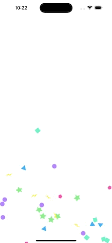
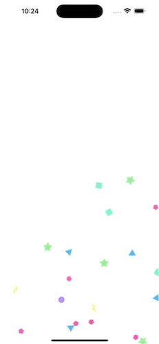
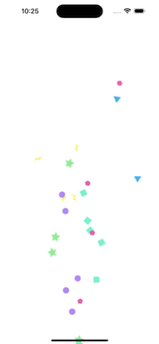

# React Native Simple Confetti

    

``
type="tumble"
`` &nbsp;|&nbsp; ``
type="fall"
`` &nbsp;| &nbsp;``
fromCenter=true
``


## Installation

To install the Confetti Library, run the following command:

```bash
npm install react-native-simple-confetti
```

Also install `react-native-reanimated` and `react-native-svg`.

### Expo

Package is compatible with expo. Make sure you install `react-native-reanimated` and `react-native-svg`:

```bash
npx expo install react-native-reanimated react-native-svg
```

Checkout expo doc for further guidance:
[[reanimated](https://docs.expo.dev/versions/latest/sdk/reanimated/)]
[[svg](https://docs.expo.dev/versions/latest/sdk/svg/)]


## Usage

Import the Confetti component from the Confetti Library and use it in your React Native application.

```tsx
import Confetti from 'react-native-simple-confetti';

const App = () => {
  return (
    <View style={styles.container}>
      <Confetti count={50} type="tumble" />
    </View>
  );
};

const styles = StyleSheet.create({
  container: {
    flex: 1,
  },
});

export default App;
```

## Props

The Confetti component accepts the following props:

- `count` (optional): The number of confetti items to render. Default is 50. Max is 100.
- `type`: The type of confetti animation. Can be either "tumble" or "fall". Defaults to "tumble".
- `start` (optional): The starting position of the confetti animation. Default is the bottom of the container.
- `stop` (optional): The stopping position of the confetti animation. Default is 0, top of container.
- `speed` (optional): The speed of the confetti animation in ms. Default is 3500.
- `itemSize` (optional): The size of each confetti item. Default is 12.
- `svgs` (optional): An array of SVG components to use as confetti items. Custom svgs of Circle, Polygon, Polyline, Triangle, Square and Star are used as default.
- `images` (optional): An array of image sources to use as confetti items. If not present, svgs are the default rendered items.
- `fromCenter` (optional): Whether to start the confetti animation from the center of the container. Default is false.
- `testID` (optional): The test ID for the confetti component.


## Contributing

See the [contributing guide](CONTRIBUTING.md) to learn how to contribute to the repository and the development workflow.

## License

This library is licensed under the MIT License.

---

Made with [create-react-native-library](https://github.com/callstack/react-native-builder-bob)
